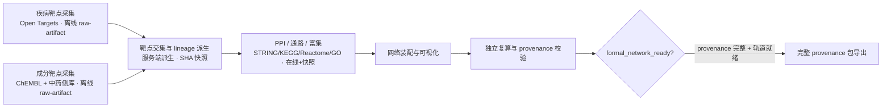
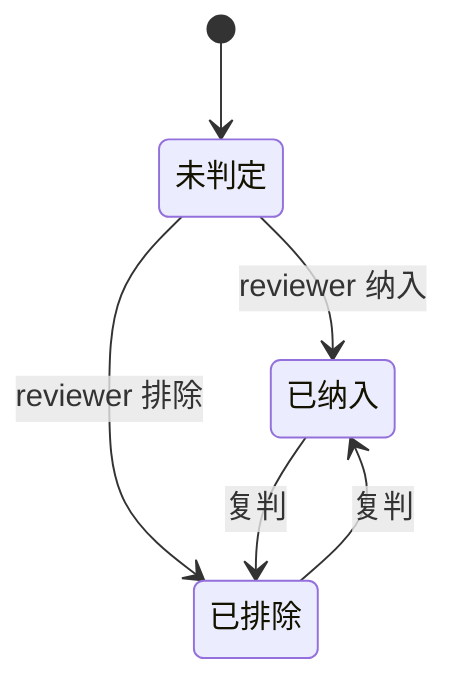

# Qiyan Nexus 产品需求文档（PRD）

| 项 | 值 |
|----|----|
| 版本 | v1.1（正式版） |
| 日期 | 2026-08-02 |
| 状态 | 正式（经 owner 四轮评审确认，2026-08-02） |
| 取代 | `docs/archive/pre-dev-planning/specs/spec.md`（归档，仅作历史参考）；v1.0 草案（2026-07-29） |
| 分工 | 本文件管"产品要什么"；`docs/current-state.md` 管"实现到哪了"；`docs/adr/` 管技术决策依据 |

> 本 PRD 把产品从归档里的"商业内测产品"重新定位为：**面向 AD（特应性皮炎）科研人员、以学术产出为成功标志的窄领域网络药理学自动化科研辅助平台**。证据工作台（文献/PDF/RAG/引用导出）降级为服务于网络的证据层。

---

## 1. 需求背景

### 1.1 触发源

2026-07-11 起，项目唯一产品主轴切换为窄领域网络药理学自动化科研辅助。原归档 PRD 描述的是商业内测产品（PostgreSQL + Neo4j + 真实 LLM、50 人内测、首月收入 ¥500–2000），与当前已冻结的"离线确定性优先、不接重依赖"技术决策严重脱节，且与真实工程进度（Gate 2 完成、Gate 3 未定义、owner-scoped adjudication 已实现未提交）失去对照关系。需要一份对齐当前方向的产品需求文件作为唯一事实源。[PM 判断]

### 1.2 用户痛点

AD 网络药理学研究的现实困境是"能跑出网络，但跑不出可发表结论"。传统流程里，疾病靶点、成分靶点、PPI、通路、富集分散在不同数据库与脚本之间，每一步的取数时间、阈值、版本无记录，交集与网络边无法追溯，审稿人无法独立复算。结果是研究者花大量时间在"把流程拼起来"和"补 provenance"上，而非科学问题本身。本平台要消除的是这段不可复算、不可审计的灰色地带。[研究-backed]

### 1.3 差异化

市面上的 TCM 网络药理学工具（TCMSP、BATMAN-TCM、SymMap 等）提供数据查询与一次性网络生成，但不把"每条 lineage 可独立复算、可审计、可导出"作为产品一等公民。本平台的差异化正是把可复算 provenance 与可选人工判定内建进工作流，使产出达到期刊可复现数据共享的底线。

### 1.4 用户画像与核心旅程

#### 1.4.1 用户画像

| 画像 | 描述 | 主/次 |
|------|------|-------|
| 中医药/皮肤科方向研究生、博后 | 主力用户。研究"XX 方治疗 AD 的机制"，需要网络药理学方法支撑学位论文或小论文；痛点是可复算性与效率 | 主 |
| 青年教师/课题组负责人 | 审阅产出、决定方法学是否可发表，关注 provenance 严谨性与复算可行性 | 次 |
| 临床医生研究者 | 兼做科研的医生，重视易用性与临床可读性；非本版主要优化对象 | 次 |

第一用户是科研人员：一切功能设计以"能发表"为判据。

#### 1.4.2 核心用户旅程

1. **选题与实体确认**：确定方剂（如消风散）与表型（如 AD 风热证），确认平台内置实体或自定义
2. **建立研究任务**：填写表型、物种（`Homo sapiens`）、证据策略、查询日期
3. **采集双侧靶点**：疾病侧（Open Targets）+ 成分侧（ChEMBL/中药侧库）离线 raw-artifact 校验
4. **交集与 lineage 派生**：服务端派生 intersection，SHA 快照封存
5. **下游装配**：STRING PPI → 通路/富集（KEGG/Reactome/GO 后置接入）
6. **独立复算与 adjudication**（可选轨道）：复算偏差为 0；人工逐行判定
7. **导出 provenance 包与报告**：审稿人可独立复算的完整包 → 写论文/投稿

---

## 2. 需求目标

### 2.1 成功标志

平台成功的判据是**赋能用户产出至少一篇可发表的真实 AD 网络药理学研究**。平台是工具，不是研究对象；学术影响力通过用户论文体现。

北极星研究由**内部团队先跑通**（owner 作为第一研究者验证平台可用性），验证后再邀请外部研究者复现/独立验证——"内部先跑"不替代外部研究者对平台真实可用性的验收。

### 2.2 北极星

选定**消风散 + AD 风热表型**作为首个可发表研究的验收示例：研究者用平台跑通"疾病靶点 → 成分靶点 → 交集 → PPI/通路 → 富集"完整可复算网络，并交付审稿人可独立复算的完整 provenance 包。消风散为 AD 经典方，代码库已具备该实体 token，验收路径最短。[已确认 2026-08-02]

### 2.3 目标量化

#### 2.3.1 北极星目标

- 首个北极星研究产出完整 provenance 包，审稿人能在本地独立复算出与原报告一致的网络。
- 每条网络 lineage row 携带来源、版本、阈值、SHA-256 快照，复算偏差为 0。
- `formal_network_ready` 在北极星研究上翻 true（定义见 §4.2）。

#### 2.3.2 过程指标（追踪日常开发是否跑偏）

| 指标 | 定义 | 目标 |
|------|------|------|
| provenance 完整率 | 每个任务必需 provenance 字段齐备的比例 | 100% |
| 复算通过率 | 独立复算偏差=0 的任务比例 | 100% |
| provenance 包导出次数 | 实际导出事件数（观测真实使用） | 追踪，不设目标 |
| adjudication 判定覆盖率 | 有判定记录的 lineage row 比例（可选轨道） | 追踪，不设目标 |
| 试用反馈闭环率 | 小范围试用反馈单中 P0/P1 问题闭环比例 | 100% |

---

## 3. 术语表

| 术语 | 含义 |
|------|------|
| lineage row | 一条靶点/网络边的来源记录，含 source、version、阈值、匹配两侧 row IDs，不可变 |
| raw-artifact | 外部数据源的原始字节快照，经服务端 SHA-256 + 受信 manifest 校验 |
| provenance | 一条结论从原始数据到最终网络边的完整可追溯链 |
| formal_network_ready | 网络是否达到可作科学声明的就绪标记（定义见 §4.2） |
| adjudication | 人工对 lineage row 的纳入/排除判定，append-only 审计流 |
| 双轨 | provenance/复算为硬门槛，adjudication 为可选叠加轨道 |
| 证据-网络双向追溯 | 网络节点/边可追溯到文献，文献可反向链接到网络节点（V1 必做显式 link 记录） |
| owner-scoped | 任务与数据按 owner_id 隔离，跨 owner 不可见 |
| 实体字典 | 方剂/成分/靶点的规范化实体库，支持自定义与 canonical 归一化 |

---

## 4. 功能需求详情

> 本章是 PRD 主体。工作流以"可复算增强五步"为主路径：经典五步之上，每步强制 lineage / provenance / SHA 快照 / 独立复算。

### 4.0 FR 优先级总表

| FR | 名称 | 优先级 | 说明 |
|----|------|--------|------|
| FR-1 | 疾病靶点采集 | **P0** | 北极星闭环必需 |
| FR-2 | 成分靶点采集 | **P0** | 北极星闭环必需 |
| FR-3 | 交集与 lineage 派生 | **P0** | 北极星闭环必需 |
| FR-4 | PPI/通路/富集 | **P0** | STRING PPI 必需；KEGG/Reactome/GO 富集后置接入 |
| FR-5 | 网络装配与可视化 | **P0** | 北极星闭环必需 |
| FR-6 | 独立复算与校验 | **P0** | 北极星闭环必需 |
| FR-7 | adjudication 工作流 | **P0** | 轨道就绪即满足，不要求真人判定 |
| FR-11 | 证据-网络双向追溯 | **P0** | V1 必做显式 link 记录 |
| FR-12 | provenance 包导出 | **P0** | 北极星闭环必需 |
| FR-8 | 文献检索 | P1 | 证据层支撑 |
| FR-9 | PDF 上传与解析 | P1 | 证据层支撑 |
| FR-10 | RAG 问答与引用 | P1 | 保留为证据服务，不作独立卖点 |
| FR-16 | 实体字典与自定义 | P1 | V1 做方剂/成分级 |
| FR-13 | 多租户隔离 | P2 | 远期目标 + 条件触发 |
| FR-14 | 合规免责 | P2 | 维持现状 + 分层披露 |
| FR-15 | 可观测性 | P2 | 维持现状 |

### 4.1 网络药理学核心工作流

#### 4.1.1 工作流总览

#### 4.1.2 FR-1 疾病靶点采集（P0）

研究者在任务表单中填写明确表型（如 AD 风热证）、物种限定为 `Homo sapiens`、证据策略与查询日期，提交后平台从 Open Targets 疾病侧采集疾病靶点。采集必须以离线 raw-artifact 形式接入：服务端对原始字节做 SHA-256，与 operator-controlled 受信 manifest 比对，经服务端 parser 派生为 `disease_targets` 集合，并在任务创建时封存 `disease_target_import`，此后不可后改。缺少独立疾病靶点来源时，disease/intersection 集合必须为空，禁止从成分集合自造交集。任务携带 `owner_id`，跨 owner 查询返回 404。

| 字段 | 说明 |
|------|------|
| 表型 | 必填，自然语言描述 AD 表型 |
| 物种 | 固定 `Homo sapiens` |
| 证据策略 | 必填，如 overall score 阈值 |
| 查询日期 | 必填，随快照封存 |

#### 4.1.3 FR-2 成分靶点采集（P0）

研究者选择方剂（如消风散）或成分集合，平台从 ChEMBL（已知活性成分）与中药侧库（TCMSP / BATMAN-TCM / TCMID，提供草药-成分-靶点映射）采集成分靶点。成分侧同样走离线 raw-artifact：SHA-256 + manifest + 服务端解析。成分靶点采集创建一个不可变的 owner-scoped 子任务，持久化 `source_task_id` 指向父任务，返回 snapshot-only 结果。子任务在两侧 raw-artifact 未完成校验前，必须跳过 provider、机制链、PPI、通路与 enrichment，保持 `chains=[]`、`enrichment=null` 与明确的 network-assembly blocker。`source_task_id` 跨 JSON/SQLite/PostgreSQL、result、report 持久化且不可变，禁止 self-link 与 child-of-child。

#### 4.1.4 FR-3 靶点交集与 lineage 派生（P0）

服务端对 disease 与 compound 两侧靶点按 canonical symbol 取交集，派生为 intersection lineage。每条 intersection 必须是一条 unique symbol 的服务端派生 row，完整引用两侧匹配的 disease lineage row ID 与 compound lineage row ID。同一 canonical symbol 的不同 source record 保留多行，unique target count 与 lineage row count 分开统计。自动抽取不得冒充人工 adjudication。交集派生后写入 SHA 快照，作为后续复算的基准。

#### 4.1.5 FR-4 PPI / 通路 / 富集（P0，富集后置）

交集靶点进入下游装配：STRING 取 PPI（**必需**），KEGG/Reactome 取通路、GO/KEGG 做富集（**后置接入**，接入前该子项标注为未启用）。下游源采用混合原则——允许在线调用，但调用结果必须快照入库，不强求 raw-artifact 级校验。下游结果与上游 lineage 通过 target symbol 关联，每条下游边记录调用时间、源版本、参数与结果快照哈希。compound child 在两侧 raw-artifact 未就绪时不进入此步。

#### 4.1.6 FR-5 网络装配与可视化（P0）

平台将 lineage 装配为"草药-成分-靶点-通路-疾病"网络，提供可视化页面：节点缩放、筛选、键盘可达、导出图片。网络图必须能从任意节点/边追溯到上游 lineage row 与下游证据。可视化是只读观察面，不得借读取推进任务状态或写 runtime。

#### 4.1.7 FR-6 独立复算与 provenance 校验（P0）

平台提供独立复算能力：给定任务 ID 与封存的 raw-artifact 快照，重新跑一遍派生流程，与原结果逐 lineage 比对。复算偏差必须为 0；任何偏差标记为复算失败并阻断 `formal_network_ready`。复算输入只读封存快照，不触达在线源。

### 4.2 人工判定（adjudication）双轨

#### 4.2.1 双轨模型

provenance/复算是硬门槛，adjudication 是可选轨道。平台同时提供 adjudication 工作流，但不强制研究者走通。两条路都能让网络达到各自语义下的就绪。

#### 4.2.2 `formal_network_ready` 定义

| 条件 | 是否满足 |
|------|----------|
| 两侧 raw-artifact 快照完整 | 必需 |
| 服务端派生 lineage 完整 | 必需 |
| 独立复算通过（偏差为 0） | 必需 |
| adjudication 轨道就绪可用（工作流已实现可调用） | 必需 |
| 实际有 reviewer 完成判定 | **不要求** |

> 规范解读：`formal_network_ready = true` 要求 provenance 完整且 adjudication 轨道就绪可用；实际是否有人判定不阻塞 true。轨道"就绪"指工作流已实现并可调用，而非"已有人走过"。[owner 终确认 2026-08-02]
>
> 配套披露义务：`formal_network_ready=true` 是 **engineering ready**，不是 scientific validity。报告与 UI 必须把"判定人数/判定记录数"作为独立披露字段展示，防止被误读为科学有效。

#### 4.2.3 FR-7 adjudication 工作流（P0）

reviewer 对单条 lineage row 做纳入/排除判定，判定以 append-only 审计流记录，与冻结快照平行，不属于快照本身。同一 lineage row 多次判定按 latest-wins 投影到结果响应信封，`reviewer_id` 持久化但从不回投到 lineage row。判定流结构上不翻转 `formal_network_ready`，也不回写冻结 lineage 的 `adjudication_status` / `decision`。

| 约束 | 说明 |
|------|------|
| reviewer 身份 | 只能来自 access token 验证后的 request state；受保护部署由可信 nginx 覆写 `X-Qiyan-Reviewer` |
| 禁止信任 | 浏览器或客户端直传的 reviewer header 一律不信任 |
| 写与读错误分离 | 写操作与其后刷新界面的读取必须分开捕获错误，避免把已落库写报成失败诱导重试 |

### 4.3 证据服务层

证据服务层服务于网络研究，不作独立产品。核心要求是与网络层形成**双向可追溯**。

#### 4.3.1 FR-8 文献检索（P1）

支持中英文文献检索，复合检索（疾病 + 中医证候/方药 + 通路关键词），双语切换。检索结果可被网络节点/边引用为证据来源。文献数据按 source type（cn_literature / pubmed）区分，语言检测决定 preferred_source_type tie-breaker。

#### 4.3.2 FR-9 PDF 上传与解析（P1）

研究者上传论文 PDF，上传仅落盘并置 `pending`，需单独触发自动解析才推进到 `parsed` / `failed`。文本层 PDF 用文本预览，扫描/空/不可读 PDF 回退到文件级占位说明。解析成功后写入 `uploaded_pdf` chunk，使 RAG 检索可引用；失败只翻转状态并 bump `parse_attempt_count`。PDF 流分两步，upload endpoint 不做重解析。稳定 upload ID 由 `literature_id + file_name` 派生，保证幂等。

#### 4.3.3 FR-10 RAG 问答与引用（P1）

RAG 对文献库做问答，返回带引用卡片的回答（来源标题、页码/段落、置信度）。每个 `citations[*].literature_id` 必须能被文献详情接口解析。所有 AI 输出必须附带免责声明 `非诊断结论、需结合临床。`（逐字节一致，load-bearing）。默认走确定性 keyword 检索；可选 embedding / hybrid / 真实 LLM 为显式 opt-in，不进入默认路径。

定位：**保留为证据服务**——RAG 问答的角色是"检索证据、回填引用"，服务网络研究的证据需求，不作独立产品卖点。入口保留，不在 PRD 展开独立功能规划。

#### 4.3.4 FR-11 证据-网络双向追溯（P0，V1 必做）

每个网络节点/边可追溯到一篇或多篇文献/RAG 引用；反之，文献详情可反向展示其被哪些网络节点/边引用。**V1 必须落地为显式 link 记录落库**（网络节点/边 ↔ 文献/RAG 引用），而非当前"仅共享 token"的松耦合运行时拼凑。双向链接通过共享实体 token（方剂/成分/靶点/通路名称）建立，但 link 必须持久化、可查询、可导出。[owner 确认 2026-08-02：V1 必做显式 link]

### 4.4 可复现导出

#### 4.4.1 FR-12 完整 provenance 包导出（P0）

平台导出审稿人可独立复算的完整包，包含：双侧 raw-artifact 字节、全部 lineage row、交集派生参数、下游调用参数与结果快照、独立复算脚本、SHA-256 manifest。导出包必须能在无网络环境下复算出与原报告一致的网络。导出是只读快照，不推进任务状态。导出与 Markdown/DOCX 报告导出分开：报告给人读，provenance 包给审稿人复算。

### 4.5 实体字典与自定义（FR-16，P1）

- **自定义范围**：研究者可自定义**方剂（含组方成分）与成分级实体**；靶点级自定义后置。方剂自定义后可进入 FR-2 成分靶点采集链路。
- **平台职责**：canonical symbol 归一化（同义映射、大小写/命名规范）、去重；同一 canonical symbol 的不同来源记录保留多行（unique count 与 row count 分开）。
- **内置字典定位**：seed 实体字典（消风散等）是初始值，不是硬编码限制。
- 自定义实体与内置实体同等待遇：进入 lineage、复算与导出。[owner 确认 2026-08-02：全链路可自定义，V1 做方剂/成分级]

### 4.6 平台基座（多租户目标）

#### 4.6.1 FR-13 多租户隔离与访问控制（P2，远期）

目标部署形态为云端多租户，多课题组隔离。任务、数据、判定按 tenant / group / owner 三级隔离，扩展现有 `owner_id` + access token 模型。浏览器代码不得接收或转发后端 access token；受保护部署由 nginx 鉴权后注入 token 与 reviewer 身份。后端必须保持 loopback 或受信网关后部署。

**启动条件（owner 确认 2026-08-02）**：出现多人并发/多课题组真实需求时，先重开生产化 ADR、设计数据库 claim/lease 或等价原子协议，再启动迁移；本版 PRD 只定义目标与约束，不给迁移工时。

#### 4.6.2 FR-14 合规免责（P2，维持现状 + 分层披露）

所有 AI 输出、报告、导出必须附带免责声明 `非诊断结论、需结合临床。` 合规界面包含 AI 输出免责、用户协议、隐私政策、算法说明，符合 PIPL 要求。临床数据脱敏，权限控制到位。

**算法说明分层披露（owner 确认 2026-08-02）**：

| 层 | 披露内容 |
|----|----------|
| 第一层（默认路径） | 明确披露「默认确定性关键词检索 + 离线快照派生，非 AI 生成结论」 |
| 第二层（可选路径） | 可选 LLM/embedding 路径需用户显式开启，输出标注 provider 名称、grounding 状态与置信度信息 |
| 第三层（判定状态） | 报告与 UI 始终披露 adjudication 判定人数/记录数，区分 engineering ready 与 scientific validity |

#### 4.6.3 FR-15 可观测性（P2，维持现状）

任务状态、复算结果、adjudication 审计流、导出记录可观测。report GET 为只读观察接口：queued/running → 202，completed → 200，failed → 409，不得借读取推进状态或写 runtime。

---

## 5. 非功能性需求

| 项 | 要求 |
|----|------|
| 部署形态 | 云端多租户为目标架构；当前本地离线确定性预览为近期验证载体，分阶段迁移。多租户需先设计数据库 claim/lease 或等价原子协议，再承诺多 worker exactly-once |
| 可复现性 | 完整 provenance 包在无网络环境下复算偏差为 0 |
| 数据源原则 | 靶点侧（疾病/成分）离线 raw-artifact；下游 PPI/通路/富集允许在线 + 结果快照 |
| 规模预期 | 文献库百级（当前 344 篇 pubmed_live + seed），单任务靶点千级（Open Targets 一个病的 associatedTargets）；性能目标=单机本地秒级响应 |
| 实体归一化 | 平台负责 canonical symbol 归一化与去重；同 symbol 多 source 保留多行 |
| 并发 | network-task repository 共享 canonical DB path 锁在单进程内有效；多进程需先设计 claim/lease |
| 可访问性 | 全页键盘可达，对比度满足 WCAG AA，图表有关联文本描述 |
| 视觉 | 青黛绿主色 `#0d9488`~`#14b8a6`，浅色产品端，Noto Sans SC |
| 安全 | Secret 不进仓库，只写 `.env.example`；后端 loopback；reviewer 身份只来自服务端验证 |

---

## 6. 非目标

- 不做全病种泛化——现阶段只做特应性皮炎
- 不替代医生诊断——仅作辅助决策工具
- 不做普通患者 C 端——只服务医生与科研人员
- 不自训大模型——使用成熟 API + 开源模型，且不进入默认路径
- 不含肠-脑-皮肤轴菌群/辨证扩展模块（远期不纳入本版 PRD）
- 不把 E2E / 真实 LLM / PostgreSQL / pgvector / Neo4j / Celery / Redis / MinIO / 对象存储 / 支付作为默认路径；均为显式 opt-in 或后续 spike
- 不把"能记录判定"等同于"已有人判定"，更不等同于科学有效
- 不做云端多租户的近期排期——远期目标，条件触发（见 FR-13）
- V1 不做靶点级自定义实体——只做方剂/成分级（见 FR-16）

---

## 7. 验收标准（北极星）

以**消风散 + AD 风热表型**为验收示例，由**内部团队先跑通**。

| AC | Given | When | Then |
|----|-------|------|------|
| AC-1 疾病靶点 | 研究者提交 AD 风热表型 + Homo sapiens + 证据策略 + 查询日期 | 触发疾病靶点采集 | 产出 `disease_targets`，封存 `disease_target_import`，附 SHA-256 快照 |
| AC-2 成分靶点 | 研究者选择消风散 | 触发成分靶点采集 | 产出 `compound_targets` 子任务，`source_task_id` 指向父任务，snapshot-only |
| AC-3 交集 lineage | 两侧靶点就绪 | 服务端派生 | 产出 intersection lineage，每条引用两侧 row IDs，SHA 快照 |
| AC-4 下游装配 | 交集就绪 | 调用 STRING（PPI 必需）；通路/富集按接入进度 | 产出 PPI；通路/富集接入前标注未启用，接入后结果快照入库 |
| AC-5 独立复算 | 任务完成 | 触发复算 | 偏差为 0，`formal_network_ready` 翻 true |
| AC-6 双向追溯 | 网络装配完成 | 点击节点/边 | 可追溯到文献（显式 link 记录）；文献详情可反向链接到网络节点 |
| AC-7 provenance 包 | 任务 ready | 导出 | 审稿人在无网络环境下复算出一致网络 |
| AC-8 免责与披露 | 任何 AI 输出/报告/导出 | 查看 | 含 `非诊断结论、需结合临床。`；报告披露 adjudication 判定人数/记录数 |

---

## 8. 里程碑与迭代路径

近期关键路径：先修红线、恢复绿基线，再推进真实数据闭环。里程碑**不排时间**，只定义阶段与退出条件；时间由 `docs/plans/` 开发计划决定。[owner 确认 2026-08-02]

| 阶段 | 内容 | 退出条件 |
|------|------|----------|
| M0 恢复绿基线 | 修 E2E 红线（`e2e/main-path.spec.ts`、`e2e/literature-data-source.spec.ts` 的 `networkidle` 超时）；提交 owner-scoped adjudication | verify-local 全绿，adjudication 入库 |
| M1 source-bound 装配 gate | 定义并独立验证 source-bound network-assembly gate；compound child snapshot-only 边界由 validator/report/UI 共同执行 | gate 可独立验证 |
| M2 真实数据闭环（最小闭环） | 中药侧接入 TCMSP（备选 BATMAN-TCM），下游先接 STRING；KEGG/Reactome/GO 富集后置；同步落地 FR-16 方剂/成分级自定义实体 | 真实数据可跑通五步（PPI 部分） |
| M3 小范围试用 + 北极星研究 | 内部先跑通消风散 + AD 风热证完整可复算网络；医生 + 科研 reviewer 各若干走查核心工作流（FR-1/2/3/5/6/7/11/12），反馈单 P0/P1 全闭环 | AC-1~AC-7 全过；试用反馈闭环率 100% |
| M4 可发表 | 交付完整 provenance 包，研究者据此产出可发表论文；邀请外部研究者复现/独立验证 | 审稿人独立复算成功 |
| 远期 | 分子对接/MD（schema 概念预留）、云端多租户迁移（条件触发）、靶点级自定义实体、富集全量接入 | 不在本版排期 |

---

## 9. 风险与依赖

| 风险 | 描述 | 缓解 |
|------|------|------|
| 外部源可用性与版本漂移 | Open Targets / ChEMBL / TCMSP / STRING 的 schema 与数据版本变化可能导致派生结果漂移 | raw-artifact 快照 + manifest + 版本封存；离线优先原则 |
| 外部源许可边界 | TCMSP / BATMAN-TCM 等中药侧库的数据再分发许可未核实，可能影响 provenance 包导出内容 | 接入前做许可核对；快照仅本地使用；导出包按许可裁剪 |
| 审稿人复算的现实摩擦 | 复算脚本依赖运行环境（Python 版本、依赖），审稿人本地可能无法直接跑通 | provenance 包自包含 + 文档化运行环境 + 复算脚本最小依赖 |
| `formal_network_ready` 被误读 | ready=true 可能被误读为科学有效（实际只要求轨道就绪） | 报告/UI 分层披露（见 FR-14 第三层）：始终展示判定人数/记录数 |
| 靶点数据质量 | 跨库 symbol 命名不一致导致交集误判 | canonical 归一化 + 多行保留 + 交集引用两侧 row ID |
| 规模假设失效 | 文献库或靶点量级超出"百级/千级"假设 | 见 NFR 规模预期；超规模时先做索引/存储策略 spike 再承诺 |
| 中药侧库不确定性 | TCMSP 的稳定性与离线化难度可能拖慢 M2 | 最小闭环先接一个源；BATMAN-TCM 作为备选并行评估 |
| 真人判定长期缺失 | adjudication 轨道长期无人使用，审计价值未兑现 | 通过小范围试用推动真实判定；试用反馈闭环 |

---

## 10. 约束与假设

### 10.1 约束（继承自已冻结技术决策）

技术栈与分层、CORS、免责声明字节一致、RAG 契约、runtime state 不回写 seed、reviewer 身份只来自服务端验证、靶点集合失败关闭、双侧 raw-artifact 只建冻结快照不自动授权下游结论、adjudication 不翻转 `formal_network_ready` 等约束，详见 `AGENTS.md` / `CLAUDE.md` / `docs/adr/`。本 PRD 不重述实现细节，只将其作为产品级硬约束引用。

### 10.2 假设（owner 评审确认状态）

| 假设 | 状态 |
|------|------|
| 北极星表型 = AD 急性期风热证，方剂 = 消风散 | ✅ 已确认（2026-08-02） |
| `formal_network_ready` = 轨道就绪即可翻 true，不要求真人判定 | ✅ 已确认（2026-08-02） |
| 云端多租户为远期目标，条件触发，不给迁移工时 | ✅ 已确认（2026-08-02） |
| 平台基座（认证/合规/可观测）视为既有基础设施，本版不展开新增需求 | ✅ 已确认（2026-08-02） |
| 内测规模与文献/靶点数据量沿用 `docs/current-state.md` 现状 | ✅ 已确认（2026-08-02，补充百级文献/千级靶点 NFR） |
| 北极星研究由内部团队先跑通，再邀请外部复现 | ✅ 已确认（2026-08-02） |
| 小范围试用（医生 + 科研 reviewer 走查）作为北极星验收前验证手段 | ✅ 已确认（2026-08-02） |
| 证据-网络双向追溯 V1 必做显式 link 记录 | ✅ 已确认（2026-08-02） |
| 实体自定义全链路可自定义，V1 做方剂/成分级，归一化是平台职责 | ✅ 已确认（2026-08-02） |
| 真实数据源接入按最小闭环顺序（TCMSP/BATMAN-TCM + STRING 先，富集后置） | ✅ 已确认（2026-08-02） |

---

## 11. 修订记录

| 版本 | 日期 | 变更 |
|------|------|------|
| v1.0 | 2026-07-29 | 草案：重新定位为网络药理学主轴（取代归档 spec.md） |
| v1.1 | 2026-08-02 | 正式版：owner 四轮评审确认。新增 §1.4 用户画像与核心旅程、§2.3.2 过程指标、§4.0 FR 优先级总表、§9 风险与依赖、§10.2 假设确认表；FR-11 升级为 P0（V1 显式 link）；新增 FR-16 实体字典与自定义（P1）；FR-13 补充启动条件；FR-14 细化分层披露；§5 补充规模预期与实体归一化；§8 里程碑补充小范围试用并明确不排时间；§10 假设全部确认 |
